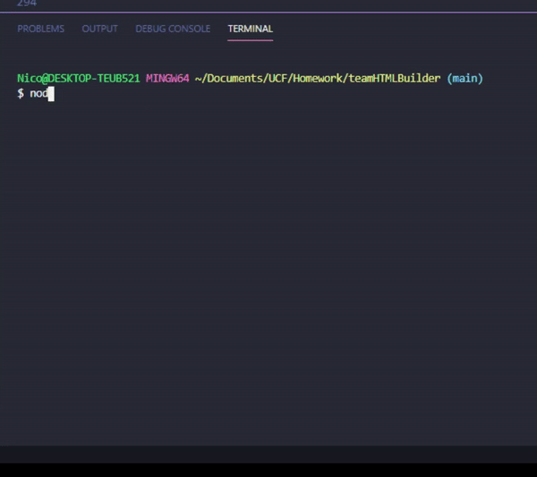
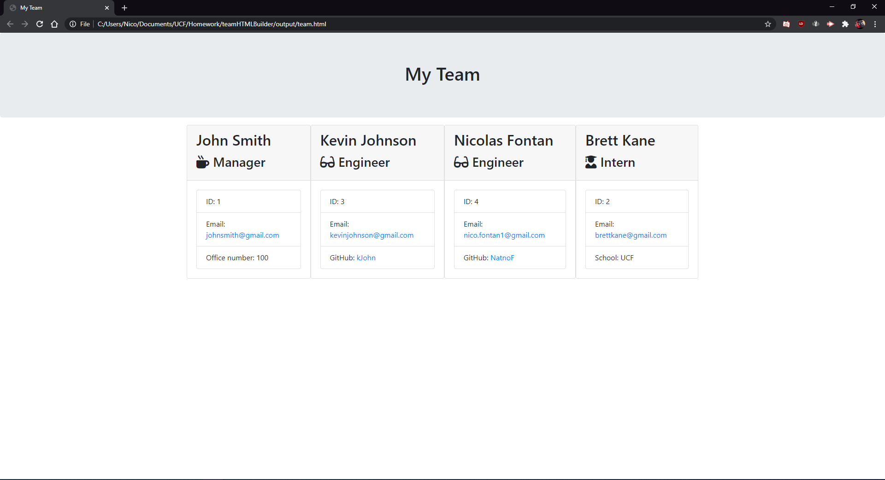

# teamHTMLBuilder

## Description 
This project will use inquirer to ask you about your team's make-up and build an HTML file displaying each team member. So it will take in All member's name, id, email as well as one unique thing for each of the three roles: Manager, Engineer, and Intern. For the intern it will ask for the school they're attending, for the engineer it will ask for their github, and for the manager it will ask for their office number. Once the data is collected it will append it to the page in a stylish way, in the form of cards.

## Table of Contents
- [Installation](#installation)
- [Usage](#usage)
- [License](#license)
- [Contributing](#contributing)
- [Tests](#tests)
- [Questions](#questions)

## Installation
To install use the following command
> npm i

## Usage
Clone the repository to your computer, open it with vsCode or anything like that, npm i to install the dependencies, and node app.js to run the program.

## License
MIT

## Contributing
No contributions are being allowed

## Tests
To run tests use the following command 
> npm test

## Questions
Have any questions? Reach out to me at nico.fontan1@gmail.com or https://github.com/NatnoF